# Architecture overview

The big picture of mmerp in diagrams. This document does not replace the detailed docs: each section has only a diagram, a few key points, and links to where the full description lives. When a diagram and a detailed doc disagree, the detailed doc is right.

## 1. The system in context

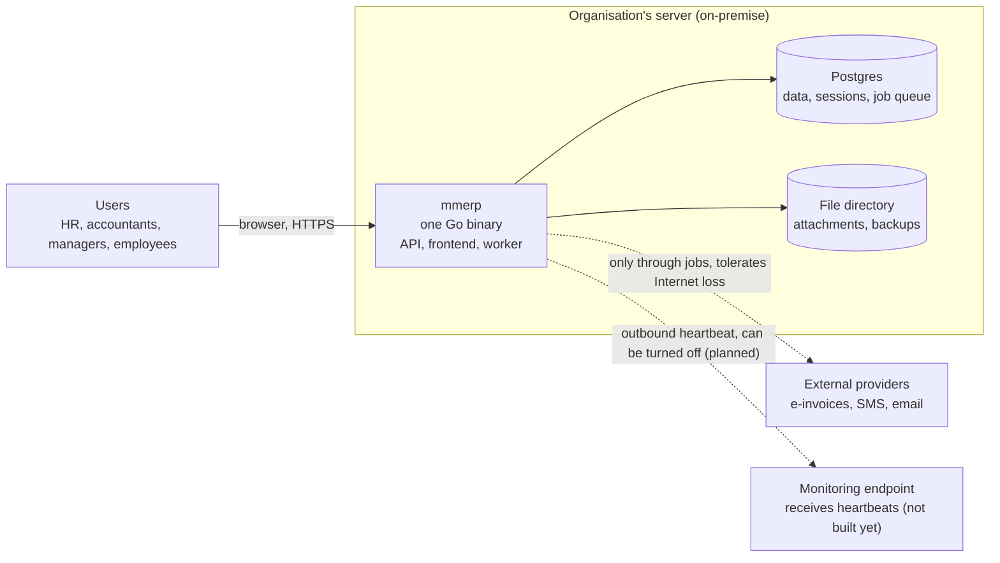

- There is only **one binary and Postgres**. No Redis, no broker, no sidecar container ([techstack.md](./techstack.md#constraints)).
- No business operation needs the Internet. Every outbound call goes through a job ([platform.md](./platform.md#integrations)).
- A hosted multi-tenant deployment runs the same binary (see [section 10](#10-deployment-and-tenancy)).
- The heartbeat is not built yet; it comes in [M10](./roadmap.md#m10-on-premise-operations) ([platform.md](./platform.md#operations)).

## 2. Inside the binary

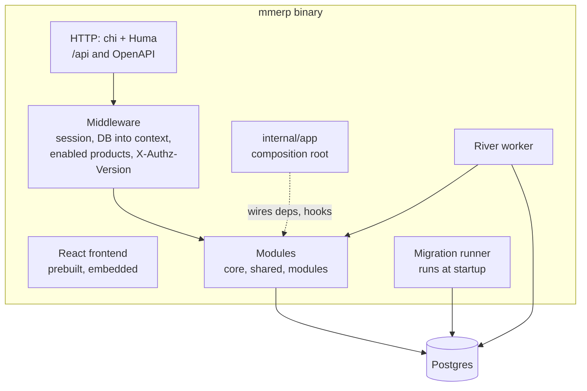

- At startup: migrate in one transaction (transaction-scoped advisory lock), and only then open HTTP and start the workers. The automatic backup before migrating is not built yet ([tenancy.md](./tenancy.md#update-procedure-on-premise)).
- Services never hold a DB variable; the DB always comes from the context ([backend.md](./backend.md#transactions)).

## 3. Backend layers

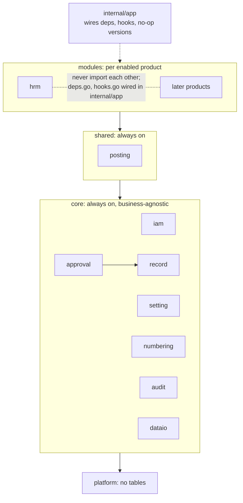

- Dependencies only point down. Within `modules`, modules never import each other ([backend.md](./backend.md#layers)).
- A lower module that needs to call upward (such as `record` asking `approval`) defines an interface in its `hooks.go`.
- `deps.go` holds required dependencies, never with a no-op version; `hooks.go` holds optional reactions, which may be no-ops ([backend.md](./backend.md#rules-between-modules)).

## 4. One module

```
internal/modules/hrm/
├── module.go       Module(s *Service) → platform.Module: the only entry point
├── service.go      exported methods for other modules
├── types.go        exported types
├── deps.go         Deps struct + interfaces needed from other products
├── handler.go      HTTP, not exported
├── queries.sql     the module's SQL, code generated by sqlc
└── internal/store/ generated code; other modules cannot import it
```

A file that would be empty is left out: `hrm` emits no hooks yet, so it has no `hooks.go`.

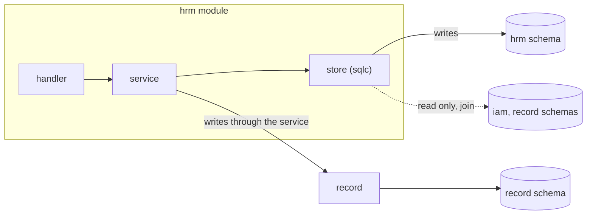

- Each module has one Postgres schema with the same name; only the owning module writes to it. Reads may join across schemas ([backend.md](./backend.md#rules-between-modules)).

## 5. A request that writes a document

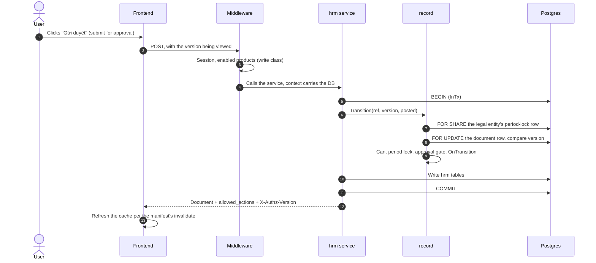

- A module calls `record` **before** writing its own tables, in the same transaction ([documents.md](./documents.md#record-functions)).
- The frontend renders buttons from `allowed_actions` and never computes permissions itself ([frontend.md](./frontend.md#permissions-the-frontend-computes-nothing)).

## 6. Document lifecycle

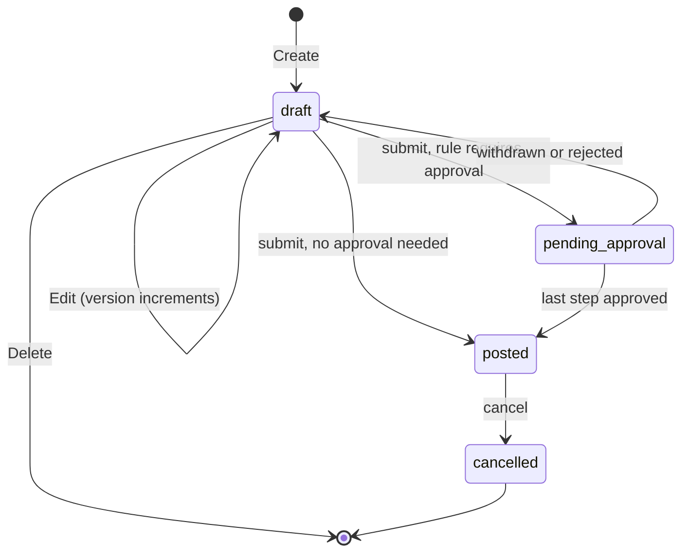

| Status | In effect | Editable |
| --- | --- | --- |
| `draft` | Not yet | Yes |
| `pending_approval` | Not yet | No |
| `posted` | Yes | No |
| `cancelled` | No longer | No |

- `record` is the only place that holds status. Business progress (delivery, payment…) is the module's own status ([documents.md](./documents.md#document-lifecycle)).

### Lock order

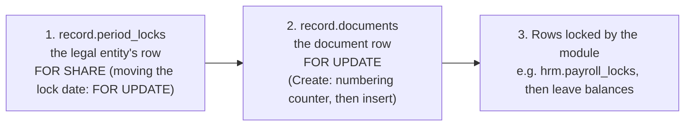

Every document write, period lock and payroll finalization takes locks in exactly this order, so there is no deadlock between them and no new document slips into a period that was just locked. Each transaction writes only one document; bulk operations are jobs that process each document in its own transaction.

## 7. Approval

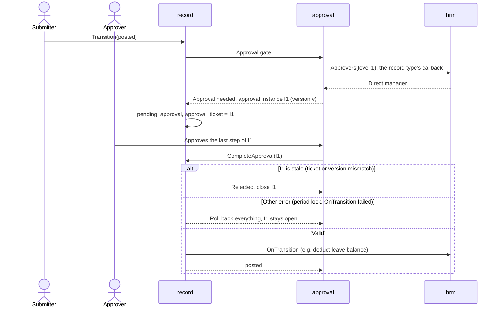

- Each submission is its own approval instance; a late approval of an older submission is rejected ([documents.md](./documents.md#record-functions)).
- Approvers are fixed when a step starts; submitters never approve their own submission.
- `approval` calls `Approvers` through a callback that `hrm` registers with the record type, without importing `hrm`.

## 8. Business lines and posting

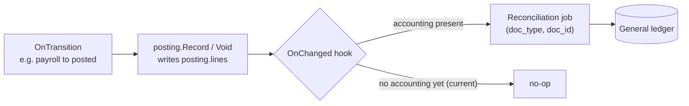

- Business lines are captured once, in the same transaction as the status transition, even before accounting exists ([ADR-0003](./docs/adr/0003-business-lines-are-data.md)).
- Business lines never carry per-person sensitive amounts.

## 9. Enabled products and background jobs

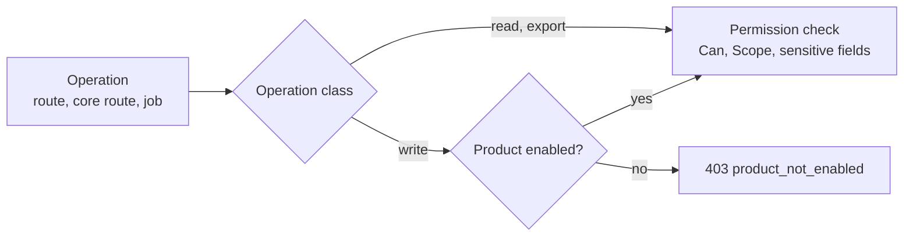

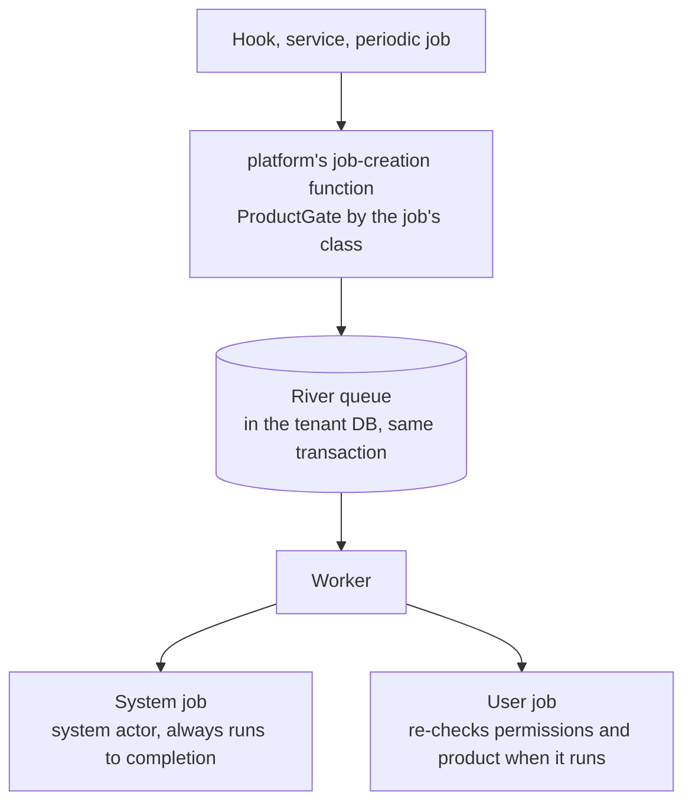

- A product that is not enabled, or has been disabled, can still be read and exported ([platform.md](./platform.md#enabled-products)).
- Moving work to the background never escalates permissions ([documents.md](./documents.md#jobs-moving-to-the-background-does-not-raise-permissions)).

## 10. Deployment and tenancy

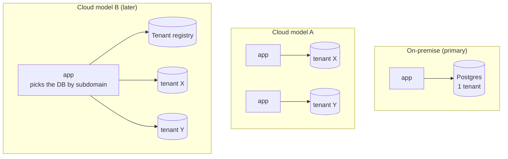

- Each tenant always has its own database; business code is tenant-unaware ([ADR-0001](./docs/adr/0001-one-database-per-tenant.md)).
- The job queue lives in each tenant's database ([ADR-0004](./docs/adr/0004-job-queue-in-tenant-database.md)).
- Moving to model B needs no service changes, because services already take the DB from the context ([tenancy.md](./tenancy.md#cloud-path-from-a-to-b)).

## 11. Frontend

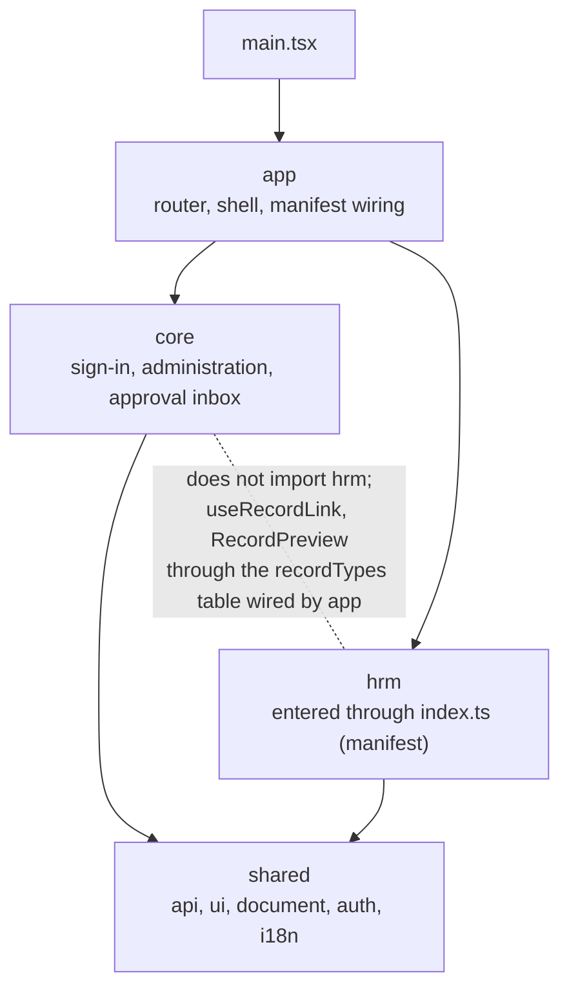

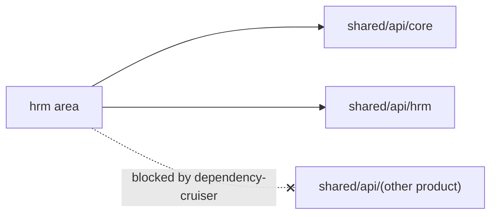

- Areas never import each other; the boundary is checked on the resolved dependency graph ([frontend.md](./frontend.md#isolation)).
- The cache belongs to a session: a 401, signing out, changing language or a changed `authz_version` clears everything and reloads the page ([frontend.md](./frontend.md#session-lifecycle)).
- Every screen is assembled from the page templates and primitives of `shared/ui` ([ui.md](./ui.md)).

## 12. Further reading

| To learn about | Read |
| --- | --- |
| Principles and non-goals | [README.md](./README.md) |
| Glossary | [CONTEXT.md](./CONTEXT.md) |
| Modules, layers, transactions, isolation | [backend.md](./backend.md) |
| Documents, approval, period locks, posting | [documents.md](./documents.md) |
| Frontend, manifests, cache | [frontend.md](./frontend.md) |
| UI rules | [ui.md](./ui.md) |
| Identity, enabled products, operations, personal data | [platform.md](./platform.md) |
| Tenancy, migrations, backups | [tenancy.md](./tenancy.md) |
| Technology | [techstack.md](./techstack.md) |
| HRM product | [products/hrm.md](./products/hrm.md) |
| Plan | [roadmap.md](./roadmap.md) |
| Decisions made | [docs/adr/](./docs/adr/) |
